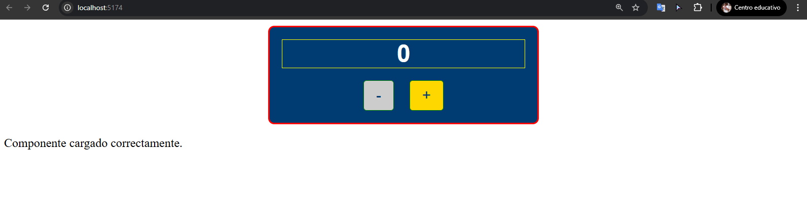
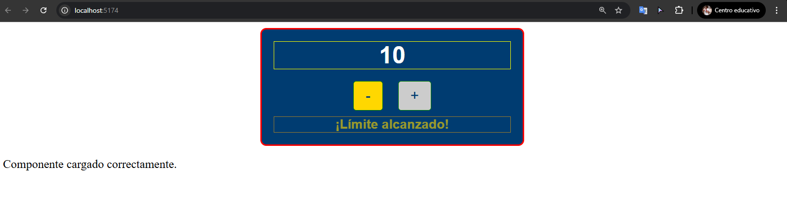

# Componente `<espe-counter-limit>`

## Descripción

El componente `<espe-counter-limit>` es un contador con un límite máximo configurable, diseñado como un Web Component utilizando LitElement. Permite incrementar y decrementar un valor hasta alcanzar un límite predefinido, notificando cambios mediante eventos personalizados y mostrando un mensaje visual cuando se alcanza el límite. Este proyecto sigue las directrices del Manual de Imagen de la ESPE y aplica buenas prácticas de desarrollo.

## Características

• Estados dinámicos: Maneja las propiedades `limit`, `count`, e `isAtLimit` para controlar el límite, el valor actual y el estado de límite alcanzado.

• Estilos institucionales: Utiliza colores institucionales (#003C71 para azul primario, #FFD700 para amarillo secundario), tipografía Arial, y espaciados basados en el Manual de Imagen (Spacing/8, Spacing/16).

• Eventos personalizados: Dispara `contador-actualizado` al cambiar el valor y `contador-al-limite` al alcanzar el límite.

• Accesibilidad: Incluye `aria-label`, `tabindex`, y `role` para soporte de teclado y lectores de pantalla.

# Uso


Incluye el componente en tu HTML con un límite personalizado:
```html
<espe-counter-limit limit="10"></espe-counter-limit>
```
  
# Explicación Técnica

## Estados Dinámicos

• Implementación: Las propiedades se definen con `@property` en TypeScript, permitiendo reactividad automática. Los valores iniciales se establecen en `firstUpdated` usando `getAttribute` para leer atributos HTML, evitando conflictos de "class-field-shadowing". Por ejemplo, `this._count` se actualiza manualmente y se refleja en el DOM mediante `requestUpdate()`.

• Ejemplo: Si `limit` se establece en 10, el contador se detiene al alcanzar ese valor, activando `isAtLimit`.

## Eventos Personalizados

• `contador-actualizado`: Se dispara con `dispatchEvent` al cambiar `count`, enviando el valor actual en `detail.count`.
• `contador-al-limite`: Se dispara cuando count iguala `limit`, enviando limit en `detail.limit`.
• Uso: Otros componentes pueden escuchar estos eventos para integrarse, como actualizar una lista o mostrar notificaciones.

## Ventajas de LitElement sobre JavaScript Puro

• Reactivity: `@property` simplifica la gestión de estados frente a manipulación manual del DOM.
• Encapsulamiento: `static styles` evita conflictos de CSS global.
• Tipado: TypeScript añade seguridad y mantenimiento, especialmente útil en proyectos complejos.
• Eventos: `dispatchEvent` estandariza la comunicación intercomponente, más eficiente que callbacks en JS puro.

## Estructura del Repositorio

• `src/`

  • `components/EspeCounterLimit.ts`: Definición del componente.
  
  • `main.ts`: Punto de entrada para importar el componente.
  
  • `index.html`: Página de prueba.

• `vite.config.ts`: Configuración de Vite.

• `tsconfig.json`: Configuración de TypeScript.

• `package.json`: Dependencias y scripts.

• `package-lock.json`: Versiones exactas de dependencias.

# Pasos de Instalación y Ejecución

1. Clona el repositorio:
```bash
git clone https://github.com/Anthonytfi/tarea2-personalizar-comportamientos.git
cd tarea2-personalizar-comportamientos
```

2. Instala las dependencias:
```bash
npm install
```

3. Inicia el servidor de desarrollo:
```bash
npm run dev
```

4. Abre el navegador en el enlace proporcionado (por ejemplo, http://localhost:5174/) y verifica el componente.

# Capturas de Pantalla
Figura 1. Componente con Contador Inicial


Nota: Elaboración propia (2025). Muestra el componente con el contador en 0.

Figura 2. Componente con Límite Alcanzado


Nota: Elaboración propia (2025). Muestra el componente con el contador en 10 y el mensaje de límite alcanzado.

# Errores Comunes y Soluciones

• Error: El contador no se actualiza.

Solución: Verificar que `requestUpdate()` se llame en `_increment` y `_decrement`, y que los campos privados (`_count`, `_limit`, `_isAtLimit`) se actualicen correctamente.

Error: La página está en blanco.Solución: 

Asegurarse de que `npm install` se haya ejecutado y que la estructura de carpetas (`src/`, `components/`) sea correcta.

# Autor

Anthony Geovanny Mejia Gaibor, junio de 2025.


